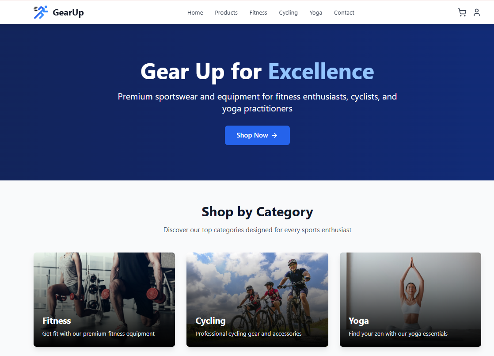
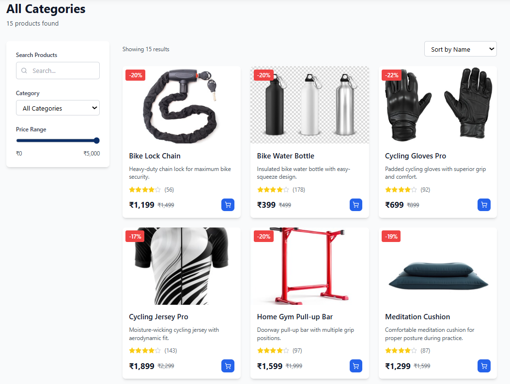
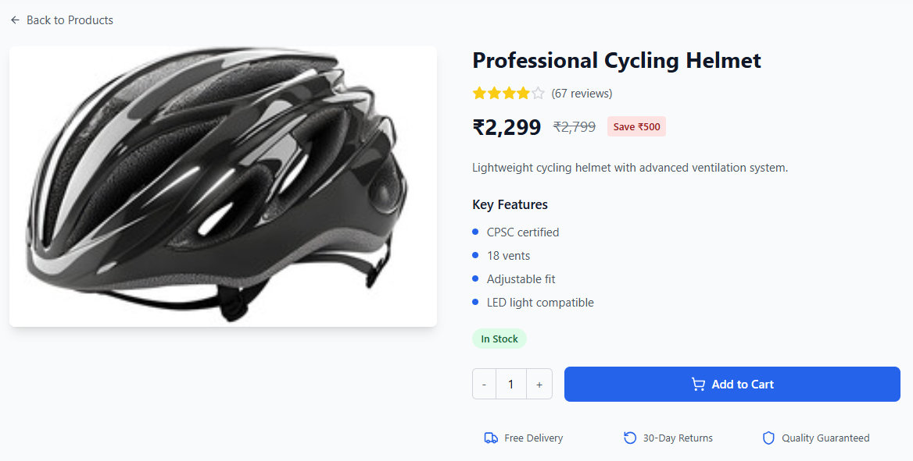
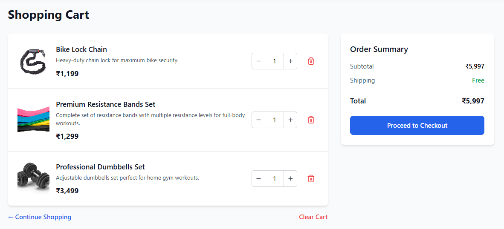
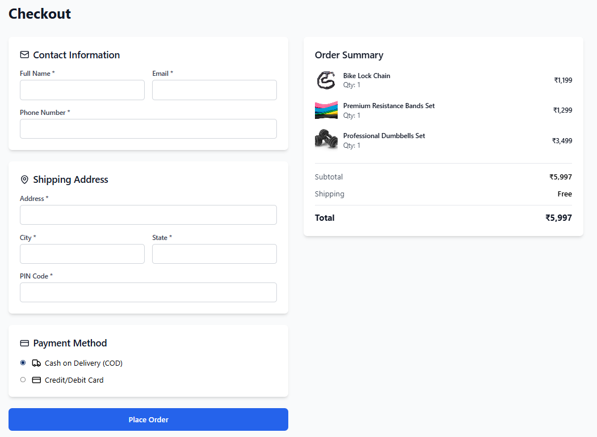
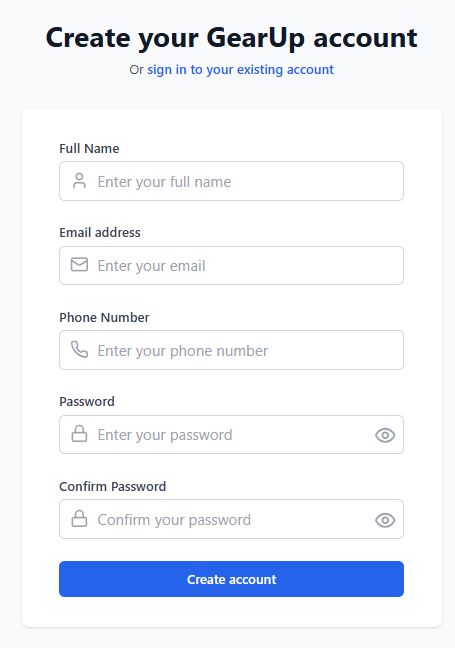
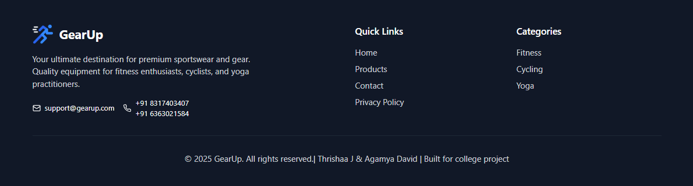

<p align="center">
  " alt="GearUp Logo" width="120" />
</p>

<h1 align="center">GearUp - Full Stack Sports Gear Store</h1>

<p align="center">
  A complete e-commerce web application built as a college project using the MERN stack (MongoDB, Express.js, React.js, Node.js).
</p>

<p>
  > ⚙️ Explore premium sports gear for Fitness, Yoga, and Cycling enthusiasts. <br/>
  > 🛒 Includes features like user authentication, product browsing, cart, checkout, and admin-ready database models.
</p>

---


👥 **Contributors**:  
- [Agamya David](https://github.com/agamyaaa14)  
- [Thrishaa J](https://github.com/Thrishaa29)  

---

## 🖼️ Screenshots

> Below are some visual previews of the GearUp website in action.

###  Home Page


###  Product Listing


###  Product Detail Page


###  Cart Page


###  Checkout Page


###  Signup Page


###  Footer Section


---

## 🛠️ Installation & Setup

> ⚠️ **Note:** This project is not deployed. To run it locally, ensure you have [Node.js](https://nodejs.org/) and [MongoDB](https://www.mongodb.com/) installed.

### 1. Clone the Repository
```bash
git clone https://github.com/your-username/project-gearup.git
cd project-gearup
```

### 2. Install Dependencies
```bash
npm install
```

### 3. Start the Project
```bash
npm run dev
```

---
## 🚀 Features

-  **User Authentication**: Sign up and log in with email and password.
-  **Product Browsing**: Browse products by category (Fitness, Yoga, Cycling).
-  **Cart Management**: Add, remove, and update items in the shopping cart.
-  **Checkout Flow**: Simple checkout system with dummy order summary.
-  **Product Details Page**: View detailed info including discount, features, and reviews.
-  **Responsive Design**: Fully responsive across devices.
-  **MongoDB Ready**: Structured backend with user, product, and order models (admin-ready).

---

## 📌 Note

This project was developed as part of a **college assignment** for learning purposes.  
It showcases full-stack MERN development and is not deployed due to hosting limitations for MongoDB.

---

